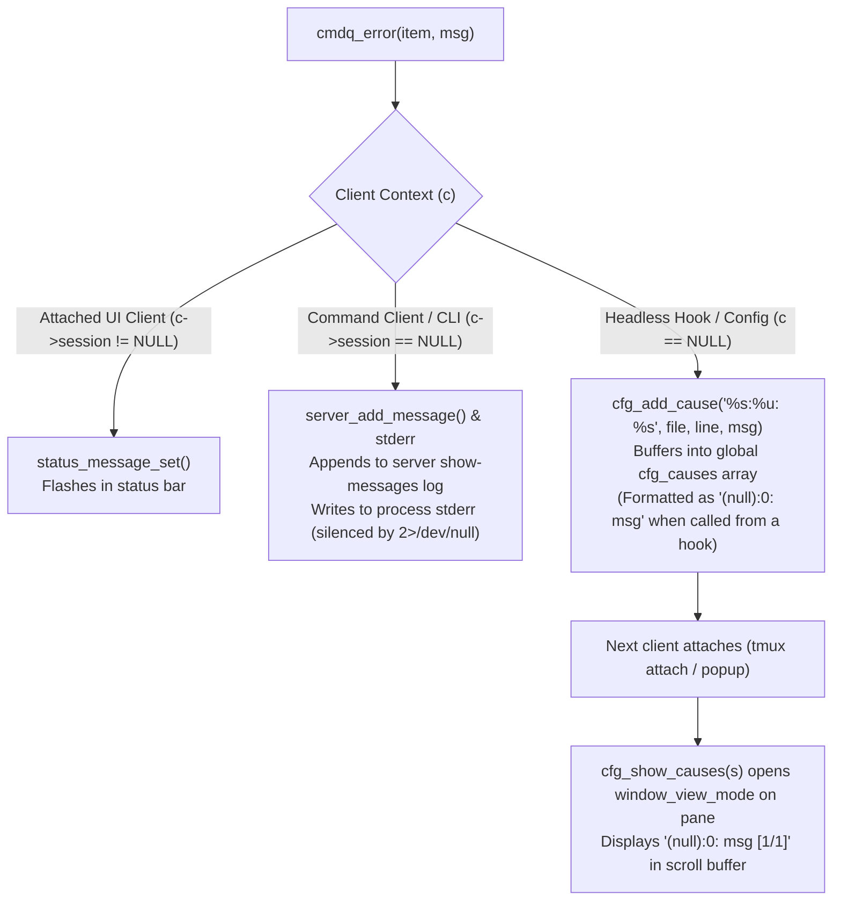

# Headless Hooks, Error Routing, and the `(null):0` Trap

How tmux handles errors across different execution contexts, why headless hooks fail with `(null):0: no current client`, and how to write client-safe hooks.

Verified against tmux 3.7b / C source analysis (`cmd-queue.c`, `cmd-find.c`, `cfg.c`).

---

## 1. How Tmux Routes Command Errors (`cmdq_error`)

When any tmux command or queue item fails, it calls `cmdq_error(item, format, ...)`. Where that error message ends up depends entirely on **who called it**:



### The Three Error Routing Paths:

| Execution Context | `item->client` | Error Destination | User Visibility |
| :--- | :--- | :--- | :--- |
| **Interactive Terminal** | Attached client (`c->session != NULL`) | Status bar message | Flashes on status line |
| **CLI Subprocess** (e.g. `tmux has -t x`) | Command client (`c->session == NULL`) | CLI `stderr` + `show-messages` queue | Printed to stderr; persists in server memory |
| **Server Hook / Config** (e.g. `window-unlinked`) | `NULL` (`c == NULL`) | Global `cfg_causes` error list | **Pops up in `window_view_mode` on next attach!** |

---

## 2. The `(null):0` View-Mode Trap

When a command in a server hook runs without an attached client, `item->client` is `NULL`.

1. **Why `(null):0`?**
   Because the command was executed dynamically from a hook rather than being read from a `.conf` file line, `file` is `NULL` and `line` is `0`. `cfg_add_cause("%s:%u: %s", file, line, msg)` evaluates to `(null):0: <msg>`.
2. **Why inside the pane content (`[1/1]`)?**
   When `tmux attach` or `tmux popup` connects to a session, `cmd_attach_session_exec()` calls `cfg_show_causes(s)`. If `cfg_causes` contains any errors, tmux immediately places the active window pane into `window_view_mode` (copy/view mode) and writes the errors into the pane scroll buffer.

---

## 3. Client-Dependent Commands

Some tmux commands inherently require a client to operate on. In the tmux C source, these are marked with `CMD_CLIENT_TFLAG` or `CMD_CLIENT_CFLAG`:

- `detach-client` (alias `detach`)
- `switch-client`
- `display-popup` (alias `popup`)
- `display-menu` / `menu`
- `confirm-before`
- `refresh-client`
- `display-panes`

### What happens when resolved without a client:
When these commands run without an explicit `-t` or `-c` flag targeting a specific client, tmux calls `cmd_find_current_client()` (`cmd-find.c`).
If the server has no attached clients at that moment, `cmd_find_current_client()` fails and raises:
```
cmdq_error(item, "no current client");
```

If this happens inside a hook, it triggers the `(null):0` trap above.

---

## 4. Writing Client-Safe Hooks

Global lifecycle hooks (`window-unlinked`, `session-closed`, `pane-exited`, `client-detached`) can trigger in the background when no client is attached (e.g. during script cleanup, automated tests, or `kill-session`).

### ❌ Dangerous: Bare Client Commands in Hooks
```tmux
# FAILS: If a window unlinks while detached (e.g. kill-session),
# 'detach' runs with c == NULL and queues '(null):0: no current client'
set-hook -ga window-unlinked "detach"
```

### ✅ Safe: Guard with `#{session_attached}` or `#{client_name}`
```tmux
# Evaluates #{session_attached} at runtime using tmux format logic:
# If session_attached == 1 -> runs detach on the attached client.
# If session_attached == 0 -> does nothing, zero errors logged.
set-hook -ga window-unlinked { if -F "#{session_attached}" "detach" }
```

---

## 5. Background Session Queries: `has-session` vs `list-sessions`

### `has-session -t <target>`
- Defined with `.target = { 't', CMD_FIND_SESSION, 0 }` (strict, no `CMD_FIND_CANFAIL`).
- When querying a non-existent session, it fails and logs `"can't find session: <target>"` into `show-messages`.
- **Note:** Standard shell redirection (`>/dev/null 2>&1`) silences stdout/stderr from your script, but does **not** stop the tmux daemon from appending the failure to its internal `show-messages` log.

### Silent Alternative for Scripts
If you want to check for session existence from external scripts without adding error lines to `show-messages`:
```bash
tmux list-sessions -f "#{==:#{session_name},my_session}" | grep -q .
```
`list-sessions` with `-f` uses format filtering instead of target resolution, succeeding with empty output (and exit code 0) when no match is found.
